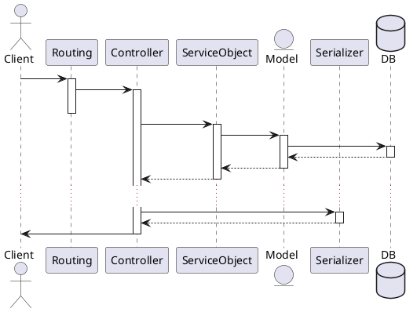

```plantuml
@startuml
actor Client as C
participant Routing as R
participant Controller as Cntr
participant ServiceObject as Inter

entity Model as M


participant Serializer as S
database DB as DB


C -> R
activate R


R -> Cntr
activate Cntr
deactivate R


Cntr -> Inter
activate Inter


Inter -> M
activate M

M -> DB
activate DB

return
return
return

...


Cntr -> S
activate S

return
Cntr -> C
deactivate Cntr


@enduml

```
